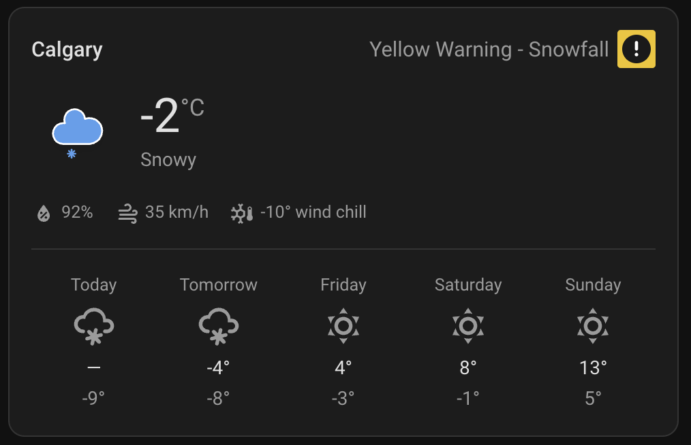

# Environment Canada Weather Card

A custom Lovelace card for Home Assistant that displays Environment Canada weather data — including EC-specific condition text, icon codes, wind chill, and humidex — using the [Environment Canada integration](https://www.home-assistant.io/integrations/environment_canada/).



## Features

- Current temperature, condition text, and Environment Canada weather icon
- Wind speed and humidity
- Wind chill (hidden when unavailable)
- Humidex (hidden when unavailable)
- Colour-coded alert icon and description (warning, watch, advisory, special weather statement)
- 5-day forecast using HA's weather forecast subscription API

## Installation via HACS

1. In HACS, go to **Frontend** and click the three-dot menu → **Custom repositories**
2. Add this repo URL and select category **Lovelace**
3. Install **Environment Canada Weather Card**
4. Reload your browser

The card's weather icons are served automatically from `/hacsfiles/environment-canada-weather-card/weather-icons/EnvironmentCanada/`.

## Manual Installation

1. Copy `environment-canada-weather-card.js` to `config/www/`
2. Copy `weather-icons/` to `config/www/weather-icons/`
3. Add a Lovelace resource: URL `/local/environment-canada-weather-card.js`, type **JavaScript module**
4. Set `icon_path: /local/weather-icons/EnvironmentCanada` in your card config

## Configuration

```yaml
type: custom:environment-canada-weather-card
weather_entity: weather.ottawa_kanata_orleans_forecast
condition_sensor: sensor.ottawa_kanata_orleans_condition
icon_code_sensor: sensor.ottawa_kanata_orleans_icon_code
wind_chill_sensor: sensor.ottawa_kanata_orleans_wind_chill   # optional
humidex_sensor: sensor.ottawa_kanata_orleans_humidex         # optional
alerts_sensor: sensor.ottawa_kanata_orleans_alerts           # optional
name: Ottawa Weather                                          # optional
show_forecast: true                                           # optional, default true
forecast_type: daily                                          # optional: daily or hourly
```

### Options

| Option | Required | Default | Description |
|--------|----------|---------|-------------|
| `weather_entity` | Yes | — | Environment Canada weather entity |
| `condition_sensor` | Yes | — | EC condition text sensor |
| `icon_code_sensor` | Yes | — | EC icon code sensor (numeric) |
| `wind_chill_sensor` | No | — | EC wind chill sensor (hidden when unavailable) |
| `humidex_sensor` | No | — | EC humidex sensor (hidden when unavailable) |
| `alerts_sensor` | No | — | EC alerts sensor; shows colour-coded icon and description when active |
| `name` | No | `""` | Card title |
| `show_forecast` | No | `true` | Show 5-day forecast |
| `forecast_type` | No | `daily` | `daily` or `hourly` |
| `icon_path` | No | HACS path | Override icon directory path |
| `icon_extension` | No | `svg` | Icon file extension |

## Weather Icons

This card ships with the official Environment Canada weather icon set (SVG format, codes `00`–`48`).
